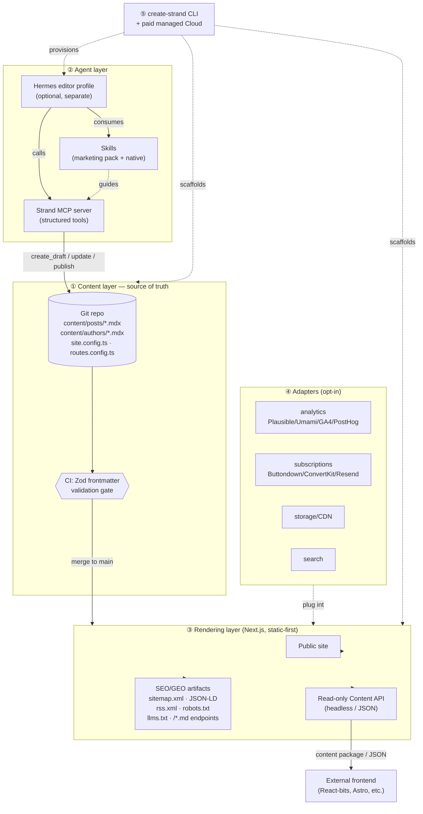
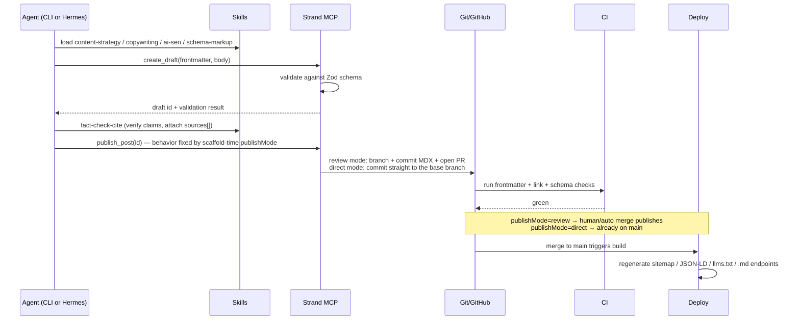

# Strand — Design

> **Strand** *(working name — a lighter, smaller thing than a Ghost; find-and-replace freely)*
> An agent-first, minimal, open-source publishing system for **programmatic blogs and news sites**. Articles are MDX files in Git, written and optimized by agents, rendered by a deployable frontend with SEO + AI-search (GEO) baked into core. No database, no CMS UI, no human-editor bloat.

---

## 1. Thesis

Ghost is a 44k-commit Node.js/MySQL monolith built around human editors: an Ember admin client, a Lexical WYSIWYG editor, members/subscriptions, newsletters, Handlebars themes, a theme marketplace. The genuinely valuable ~15% is its **content schema** and its **publishing-quality core** (sitemaps, JSON-LD, canonical tags, OG/Twitter cards, RSS). Strand keeps that core, replaces the editor with **agents + skills**, replaces the database with **Git + MDX**, and extends the SEO core for **AI search engines**.

| Kept from Ghost (re-implemented) | Cut entirely | Replaced by |
|---|---|---|
| Post content schema | MySQL database | Git + MDX files |
| SEO core (sitemap, JSON-LD, canonical, OG, RSS) | Ember admin client | Agents + skills + optional read-only dashboard |
| "Just JSON" headless decoupling | Lexical editor & Cards | Agents write MDX directly |
| Configurable routing | Members / subscriptions / Stripe | Optional `subscriptions` adapter |
| Webhooks-over-plugins philosophy | Newsletters / Mailgun | Optional `newsletter` adapter |
| CLI install ergonomics | Roles & permissions | Git permissions + agent identity + author personas |
| Open-core + paid cloud, MIT | Handlebars themes + marketplace | React/Next components, one default theme |

The new capability that makes this *not* "Ghost minus the DB" is the **GEO layer** (§5): `llms.txt`, a content-negotiated `.md` rendering of every page, FAQ/QAPage/`speakable` schema, and author-entity E-E-A-T markup. AI-search optimization is **always on** — there is no toggle for it.

---

## 2. Architecture



### Publish flow



---

## 3. Layers

1. **Content layer.** MDX in Git is the database, version history, audit log, and review workflow. `content/posts/*.mdx`, `content/authors/*.mdx`, one `site.config.ts`, one `routes.config.ts`. A Zod schema (§4) validates frontmatter in a pre-commit hook and in CI — a malformed article literally cannot merge. This is the only surface agents write to.
2. **Agent layer.** Portable **skills** (the how-to knowledge) + a **Strand MCP server** (the structured tool surface, §6) + an optional **Hermes editor profile** (a separate agent that owns the publication, §7).
3. **Rendering layer.** Next.js App Router, static-first. Reads MDX, renders the site, and emits every SEO/GEO artifact at build. **Headless mode** swaps the rendered site for a typed content package + read-only JSON Content API consumed by an existing frontend.
4. **Adapters (opt-in).** analytics (cookieless-first), subscriptions/forms, storage/CDN, search, deploy target. Each is a small interface implementation selected at scaffold time.
5. **CLI + Cloud.** `create-strand` interactive scaffolder; optional paid managed hosting (Git sync + hosted agent runtime + analytics) as the open-core business model.

---

## 4. Content model (the contract)

Single source of truth for frontmatter. Lives at `packages/core/src/schema.ts`; the `strand-content-schema` skill and the MCP `validate_post` tool both import it.

```ts
import { z } from "zod";

export const PostFrontmatter = z.object({
  // — Identity & SEO core (from Ghost) —
  title:        z.string().min(1).max(70),          // SEO title-length guard
  slug:         z.string().regex(/^[a-z0-9]+(?:-[a-z0-9]+)*$/),
  description:  z.string().min(50).max(160),        // meta description
  publishedAt:  z.string().datetime(),
  updatedAt:    z.string().datetime()               // full ISO datetime, or a bare
                 .or(z.string().regex(/^\d{4}-\d{2}-\d{2}$/)) // date ("2026-07-27")
                 .optional(),                       // → article:modified_time + visible "Updated"
  status:       z.enum(["draft", "scheduled", "published"]).default("draft"),
  author:       z.string(),                          // → content/authors/<id>.mdx
  tags:         z.array(z.string()).default([]),
  canonicalUrl: z.string().url().optional(),
  featureImage: z.object({ src: z.string(), alt: z.string().min(1) }).optional(),
  og:           z.object({ title: z.string().optional(), image: z.string().optional() }).optional(),
  noindex:      z.boolean().default(false),

  // — Structured-data type (drives JSON-LD) —
  type:         z.enum(["BlogPosting", "NewsArticle", "Article"]).default("BlogPosting"),

  // — GEO / AI-search (always emitted) —
  summary:      z.string().max(280).optional(),     // TL;DR → speakable + verbatim grounding lede
  faq:          z.array(z.object({ q: z.string(), a: z.string() })).default([]), // → FAQPage

  // — AI-search targeting (optional, head tags) —
  contentType:  z.enum(["guide", "comparison", "roundup", "news", "explainer"])
                 .optional(),                       // → <meta name="ai-content-type">
  primaryKeyword: z.string().min(1).optional(),     // lowercased → <meta name="ai-topic">
  keywords:     z.array(z.string().min(1)).min(5).max(8).optional(), // per-article meta keywords

  sources:      z.array(z.object({                  // → citation + AI-search trust
                  title: z.string(),
                  url:   z.string().url(),
                  publisher: z.string().optional(),
                })).default([]),
});

export type PostFrontmatter = z.infer<typeof PostFrontmatter>;
```

`title`, `description`, `canonicalUrl` feed the SEO core. `type`, `faq`, `sources` feed the JSON-LD `schema-markup` skill. `summary`, `faq`, `sources` feed the GEO layer. `contentType`, `primaryKeyword`, `keywords` feed the AI-search head tags (§5).

Site-level SEO policy lives in `SiteConfig` (same file): `titleSuffix` (deterministic absolute post titles — policy, not layout decoration), `generateOgImages` (opt-in per-post 1200×630 OG image route, default off), and a `SourcePolicy` primitive (allow/deny domains for `sources[]`).

---

## 5. SEO + GEO core (built-in, no plugins)

**Classic SEO** (parity with Ghost): auto `sitemap.xml` (XML-escaped), `rss.xml`, `robots.txt`, per-page `rel=canonical`, absolute post titles (+ optional `titleSuffix`), OpenGraph + Twitter cards (with an opt-in per-post 1200×630 generated OG image route via `generateOgImages`), JSON-LD (`Article`/`NewsArticle`/`BlogPosting`).

**GEO — for ChatGPT / Perplexity / Claude / AI Overviews** (the differentiator, always on):
- `llms.txt` + `llms-full.txt` at the root.
- A content-negotiated **`.md` version of every page** (or `Accept: text/markdown`) so AI crawlers ingest clean source, not hydrated React DOM. MDX makes this nearly free.
- `FAQPage` / `QAPage` + `speakable` schema from the `faq` and `summary` fields.
- Author-entity (`Person` + `sameAs`) markup for E-E-A-T trust signals.
- Inline citations + visible sources (LLMs favor cited claims), driven by `sources[]` and gated by an optional `SourcePolicy`.
- **AI-search head tags** (2026-07 audit): full `robots`/`googlebot` preview directives (`max-snippet`, `max-image-preview`, `max-video-preview`), `<meta name="ai-content-type">` / `<meta name="ai-topic">` from `contentType`/`primaryKeyword`, per-article `keywords`, and always-on `article:modified_time`.
- **Verbatim grounding lede** — the default theme renders `summary` verbatim as the article body's first paragraph (no label, no aside), so AI extraction pipelines quote it as the article's own opening; the visible "Updated" date is rendered from `updatedAt`.

---

## 6. Skills

### Tiers (coreyhaines31/marketingskills — install via skills.sh)

**Mandatory core (installed by default):** `copywriting`, `copy-editing`, `content-strategy`, `programmatic-seo`, `seo-audit`, `ai-seo`, `schema-markup`, `site-architecture`, `analytics-tracking`.

**Optional — distribution & media:** `social-content`, `image`, `video`, `directory-submissions`, `customer-research`, `marketing-psychology`, `competitor-alternatives`, `competitor-profiling`.

**Optional — gated behind the subscriptions/forms adapter:** `email-sequence`, `cold-email`, `lead-magnets`, `free-tool-strategy`, `page-cro`, `form-cro`, `popup-cro`, `signup-flow-cro`, `onboarding-cro`, `ab-test-setup`, `referral-program`.

**Skipped (SaaS-business, not publishing):** `pricing-strategy`, `revops`, `sales-enablement`, `aso-audit`, `churn-prevention`, `paywall-upgrade-cro`, `launch-strategy`, `marketing-ideas`, `co-marketing`, `community-marketing`, `ad-creative`, `paid-ads`. (`product-marketing-context` surfaced as opt-in brand grounding.)

### Native skills (not covered by the pack — shipped in `skills/`)

These operate Strand's own mechanics, so they can't be borrowed:
- **`strand-publish`** — commit MDX, open a PR, never push main, trigger deploy. → `skills/strand-publish/SKILL.md`
- **`strand-content-schema`** — write/repair frontmatter so it validates against §4. → `skills/strand-content-schema/SKILL.md`
- **`strand-fact-check-cite`** — verify factual claims, attach sources, populate `sources[]`. → `skills/strand-fact-check-cite/SKILL.md`

Default install = 9 mandatory marketing skills + 3 native skills. The installer **diffs against already-installed skills and installs only the gap** (see `skills/resolve-skills.ts`).

---

## 7. Agent integration modes

- **Skills + CLI** — marketing skills installed into the terminal coding agent (Claude Code / Cursor, via `npx skills add`) + the Strand CLI. Human-in-the-loop, no long-running agent.
- **Skills + MCP** — the Strand MCP server runs; any MCP-capable agent calls the structured tools, skills supply the how-to. Headless / programmatic.
- **Both** — both of the above, and the mode that unlocks the optional **dedicated Hermes editor profile**.

### The Hermes editor profile (optional)

A Hermes *profile* is its own home directory (own `config.yaml`, `.env`, `SOUL.md`, skills, cron, state) and gets its own command alias — so the agent stays fully **separate from the blog content repo**; the only link is `terminal.cwd` pointing at the blog checkout. Provisioned items:

| Item | Purpose |
|---|---|
| `SOUL.md` | Editorial system prompt: house voice, schema contract, PR-only rule, author personas, GEO checklist |
| `terminal.cwd` | → the blog repo path (the separation) |
| toolsets `web,terminal,skills` | research · git/build · marketing pack |
| skills | the 9+3 set, synced after dedup |
| Strand MCP connection | drive the CMS via structured tools, not raw git |
| cron (optional) | scheduled "draft the news" cadence |
| gateway (optional) | manage the publication from Telegram/Discord |

**Emit it as a Hermes profile distribution** — a git repo carrying SOUL + config + skills + cron + MCP connections, installed anywhere with `hermes profile install github.com/you/<blog>-editor --alias`, updatable via `hermes profile update` while credentials/memories/sessions stay per-machine. This is the reproducible artifact and exactly what the paid cloud tier provisions per customer. A local `hermes profile create` is the fallback. See `profile-dist/`.

---

## 8. CLI flow

```
$ npm create strand@latest
? Project name › my-news-site
? Frontend › Next.js (App Router) / Headless (content package only) / Astro
? Analytics › Plausible (cookieless, default) / Umami / GA4 / PostHog / None
? Author personas › Single / Multiple named
? Subscriptions adapter › None / Buttondown / ConvertKit / Resend
   └─ if not None → also install conversion skill set
? Agent integration › Skills + CLI / Skills + MCP / Both
? Publishing policy (yours, not the agent's — no flag overrides it)
     › Review — every post is a PR; merging publishes (default) / Direct — agent posts go live on the base branch
? Install marketing skills › Recommended core (9) / Core + distribution & media / Custom select
   └─ diffs against existing skills, installs only the gap
? [if MCP or Both] Provision a dedicated Hermes editor profile?
     › Yes (profile distribution repo) / Yes (local profile) / No
   └─ writes SOUL.md, sets terminal.cwd → blog repo, syncs skills, wires MCP, optional cron + gateway
? Deploy target › Vercel / Cloudflare Pages / Netlify / Self-host
   └─ emits a deploy-on-merge workflow (validation-gated) for the target
? Initialize Git repo + content schema + CI validation › Yes
```
AI-search/GEO is not a question — it is always on.

---

## 9. Repo layout

```
strand/
├── DESIGN.md                        ← this file
├── packages/
│   ├── core/        @strand-cms/core — schema, MDX loader, SEO/GEO generators  [built]
│   ├── create-strand/ the `npm create strand` scaffolder                     [built]
│   ├── cli/         @strand-cms/cli — `strand` bin: MCP server + `strand validate`  [built]
│   │                  src/tools.ts is the canonical MCP tool surface
│   ├── next/        @strand-cms/next — default theme (strand rail, MDX, SEO/GEO)      [built]
│   └── content-api/ @strand-cms/content-api — typed queries + JSON API + client    [built]
├── skills/
│   ├── strand-publish/SKILL.md
│   ├── strand-content-schema/SKILL.md
│   ├── strand-fact-check-cite/SKILL.md
│   └── resolve-skills.ts            ← standalone reference resolver
└── profile-dist/                    ← reference Hermes editor distribution
    ├── SOUL.md
    ├── config.yaml
    └── README.md
```

---

## 10. Open questions / roadmap

- **Done since first design:** all five code packages built and verified; the publishable
  packages build to `dist` with tsup and run under plain `node`/`npx`; deploy-on-merge
  workflows (Vercel / Cloudflare / Netlify / self-host) are emitted by the scaffolder,
  validation-gated; scaffold-time `publishMode` (review-PR vs direct-to-main);
  `titleSuffix` + `SourcePolicy` + sitemap XML safety; the AI-search head-tag layer
  (`contentType`/`primaryKeyword`/`keywords`, robots preview directives,
  `article:modified_time`); verbatim grounding lede + visible Updated date in the theme;
  opt-in per-post OG image route; GFM tables in the renderer.
- **Cloud tier (next):** hosted agent runtime (managed Hermes profile per customer) + Git
  sync + analytics + on-merge deploy. Open-core; 100% of the publishing core stays MIT.
- **Per-skill vs whole-pack install:** skills.sh exposes per-skill URLs; resolver assumes per-skill `add` with a whole-pack fallback (confirm against the skills.sh CLI).
- **Hermes config keys:** `model`, `provider`, `toolsets`, `terminal.cwd`, `compression` are confirmed from docs; `cron` and MCP-connection keys are represented best-effort in `profile-dist/config.yaml` — verify against the Hermes configuration/integrations reference before shipping.
- **Published-package assumption — resolved:** `@strand-cms/core`, `@strand-cms/cli`, and `@strand-cms/content-api` are on npm at 0.2.0 (lockstep), `create-strand` at 0.2.1. `@strand-cms/next` stays `private` — the scaffolder emits the theme files into the generated project rather than depending on it.
- **Scheduled posts:** `status: scheduled` + `publishedAt` in the future, resolved at build by a scheduled CI run (or the editor profile's cron).
